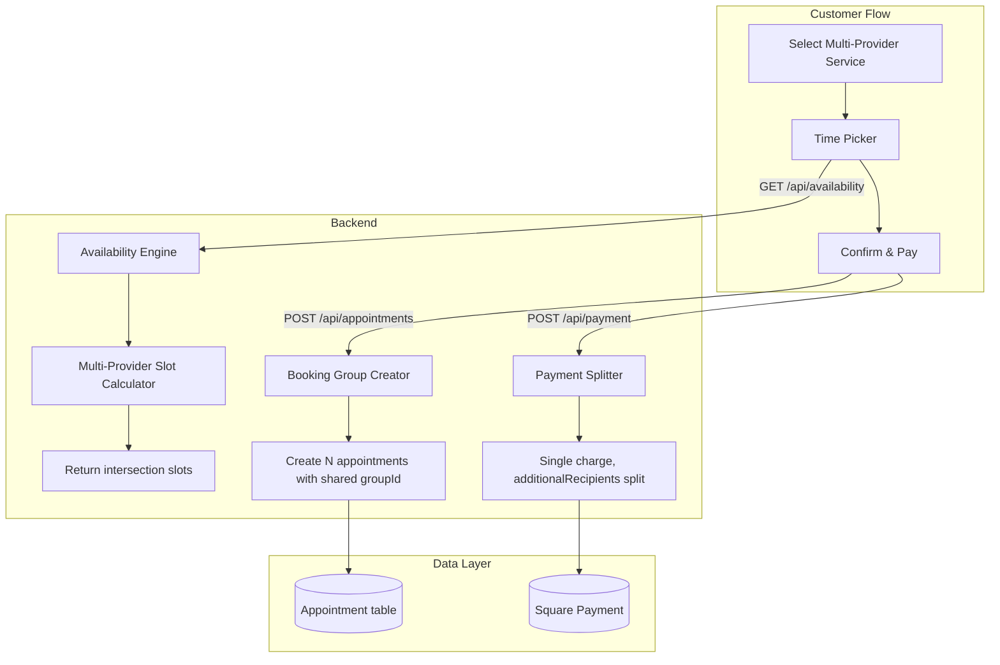
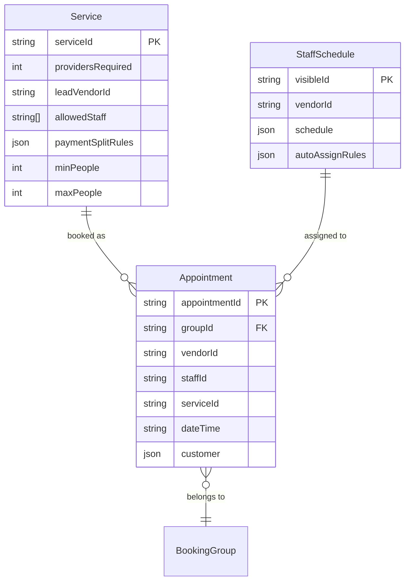

# Design Document: Couples Multi-Provider Booking

## Overview

This feature extends the existing booking system to support services that require multiple providers working simultaneously (e.g., "Couples Head Bath" requiring two staff members for two guests). The design builds on the existing availability engine, payment splitting infrastructure, and appointment model — adding multi-provider awareness at each layer.

**Key design goals:**
- Reuse existing `additionalRecipients` payment splitting (no new payment infrastructure)
- Extend the pure-function availability engine to compute N-provider intersection slots
- Link appointments via a `groupId` for atomic cancellation and dashboard visibility
- Keep the customer booking flow simple — auto-assign staff, skip provider selection

## Architecture



### High-Level Flow

1. **Service selection**: Customer picks a multi-provider service (identified by `providersRequired > 1`).
2. **Provider selection skipped**: The booking flow detects `providersRequired > 1` and jumps directly to time selection.
3. **Availability calculation**: The availability API finds slots where at least `providersRequired` staff from `allowedStaff` are simultaneously free.
4. **Staff assignment**: On confirmation, the system auto-assigns the required number of available staff.
5. **Appointment creation**: One appointment per assigned staff member, all sharing a `groupId`.
6. **Payment**: Single charge processed through the house vendor's Square account, with provider shares distributed via `additionalRecipients`.

## Components and Interfaces

### 1. Multi-Provider Availability Calculator

**Location**: `app/utils/availability.js` (new exported function)

```typescript
function getMultiProviderSlots(params: {
  service: Service;
  staffSchedules: StaffSchedule[];
  appointments: Appointment[];
  date: string; // YYYY-MM-DD
  bufferMinutes: number;
}): TimeSlot[]
```

**Algorithm:**
1. Filter `staffSchedules` to only those in `service.allowedStaff` and active.
2. For each eligible staff member, compute their available time ranges for the day (working hours minus existing appointments minus buffer).
3. Find all 30-minute-aligned slots where at least `providersRequired` staff members have a free window of `service.duration + bufferMinutes`.
4. Return the intersection set as available slots.

This is a pure function — no I/O, no side effects. It receives pre-fetched data and returns computed slots.

### 2. Multi-Provider Availability API

**Location**: `app/api/availability/route.ts` (extended)

New query parameter: `multiProvider=true`

When `multiProvider=true`:
- Fetch all staff schedules for staff IDs in `service.allowedStaff` (may span multiple vendors).
- Fetch appointments for ALL those staff members on the requested date.
- Call `getMultiProviderSlots()` instead of the single-staff path.
- Return slots without exposing specific staff assignments.

### 3. Staff Assigner

**Location**: `app/utils/staffAssigner.js` (new file)

```typescript
function assignStaff(params: {
  service: Service;
  staffSchedules: StaffSchedule[];
  appointments: Appointment[];
  date: string;
  time: string;
  bufferMinutes: number;
}): StaffAssignment[]

type StaffAssignment = {
  staffId: string;
  vendorId: string;
  staffName: string;
}
```

**Logic:**
1. Filter to eligible staff (in `allowedStaff`, active, available at the specific time).
2. Prefer staff with auto-assign rules matching the requested day.
3. Return exactly `providersRequired` staff members.
4. Throw if fewer than `providersRequired` are available (should not happen if availability was checked first).

### 4. Booking Group Creator

**Location**: `app/api/appointments/route.ts` (extended POST handler)

New request body fields:
```json
{
  "groupId": "uuid",
  "providersRequired": 2,
  "multiProvider": true
}
```

When `multiProvider: true`:
- Run staff assignment for the selected time.
- Create one appointment per assigned staff member, all sharing the same `groupId`.
- Each appointment gets the correct `vendorId` and `staffId` based on the assigned staff member's vendor affiliation.
- Return all created appointment IDs.

### 5. Payment Split Calculator

**Location**: `app/utils/payment.js` (new function)

```typescript
function calculateMultiProviderSplit(params: {
  service: Service;
  assignedStaff: StaffAssignment[];
  houseVendorId: string;
}): PaymentSplit

type PaymentSplit = {
  total: number;
  houseFee: number;
  providerShares: { vendorId: string; staffId: string; amount: number }[];
}
```

**Split logic (confirmed with stakeholder):**
- House fee: fixed `houseFeeAmount` from the service (same as existing).
- Remainder: `(price - houseFeeAmount) / providersRequired`, split equally among providers.
- Uses existing `processBundlePayment` path with `bundlePayments` array.

### 6. Group Cancellation Handler

**Location**: `app/api/appointments/cancel/route.ts` (extended)

When cancelling an appointment that has a `groupId`:
- Query all appointments with the same `groupId`.
- Cancel all of them atomically.
- If payment was processed, initiate refund through Square.

### 7. Lead Vendor Override API

**Location**: `app/api/appointments/reassign/route.ts` (new)

```typescript
POST /api/appointments/reassign
{
  "appointmentId": string,
  "newStaffId": string,
  "requestingVendorId": string
}
```

**Validation:**
- Verify requesting vendor is the lead vendor OR owns the staff being replaced.
- Verify new staff is in `allowedStaff`.
- Verify new staff has no conflicts at the booked time.
- Update the appointment record.

## Data Models

### Service Model Extensions

```typescript
// Added fields to existing Service model
Service: a.model({
  // ... existing fields ...
  providersRequired: a.integer().default(1),    // Number of staff needed
  leadVendorId: a.string(),                     // Vendor who manages this service
  minPeople: a.integer(),                       // Min guests (2 for couples)
  maxPeople: a.integer(),                       // Max guests
  paymentSplitRules: a.json(),                  // Split configuration
})
```

**`paymentSplitRules` JSON structure:**
```json
{
  "type": "equal",
  "houseFeeEnabled": true,
  "houseFeeAmount": 20
}
```

The `allowedStaff` field already exists on the Service model and will be reused to list eligible staff across vendors.

### Appointment Model Extensions

```typescript
// Added field to existing Appointment model
Appointment: a.model({
  // ... existing fields ...
  groupId: a.string(),  // Links appointments in a multi-provider booking
})
```

A secondary index on `groupId` enables efficient lookup of all appointments in a group:
```typescript
.secondaryIndexes((index) => [
  index('vendorId').sortKeys(['dateTime']),
  index('groupId')  // NEW
])
```

### Data Relationships




## Correctness Properties

*A property is a characteristic or behavior that should hold true across all valid executions of a system — essentially, a formal statement about what the system should do. Properties serve as the bridge between human-readable specifications and machine-verifiable correctness guarantees.*

### Property 1: Staff Assignment Count Invariant

*For any* valid multi-provider service with `providersRequired = N` and a set of eligible staff where at least N are available at the requested time, the staff assigner SHALL return exactly N staff members, and the booking system SHALL create exactly N appointment records.

**Validates: Requirements 2.1, 4.1, 8.3**

### Property 2: Staff Assignment Subset of AllowedStaff

*For any* staff assignment result, every assigned staff member's ID SHALL appear in the service's `allowedStaff` array.

**Validates: Requirements 2.2**

### Property 3: Assigned Staff Are Conflict-Free

*For any* staff assignment result and the set of existing appointments, none of the assigned staff members SHALL have an overlapping appointment (including buffer) at the assigned time.

**Validates: Requirements 2.3**

### Property 4: Auto-Assign Preference

*For any* multi-provider service where both auto-assign-eligible and non-auto-assign staff are available at the requested time, the staff assigner SHALL prefer staff with auto-assign rules matching the requested day over those without.

**Validates: Requirements 2.6**

### Property 5: Multi-Provider Slot Validity

*For any* time slot returned by the multi-provider availability engine, at least `providersRequired` eligible staff members (who are active, in `allowedStaff`, and working that day) SHALL be simultaneously free for the full service duration at that time.

**Validates: Requirements 3.1, 3.5, 3.6**

### Property 6: Buffer Minutes Respected in Availability

*For any* time slot returned by the availability engine and any existing appointment for an eligible staff member, the time gap between the slot and the appointment SHALL be at least `bufferMinutes`.

**Validates: Requirements 3.4**

### Property 7: Booking Group Consistency

*For any* booking group created from a multi-provider service, all appointment records in the group SHALL share the same `groupId`, `dateTime`, `customer`, and `serviceId` values.

**Validates: Requirements 4.2, 4.3**

### Property 8: Booking Group VendorId Matches Staff Vendor

*For any* appointment in a booking group, the `vendorId` on the appointment SHALL equal the `vendorId` of the staff member identified by the appointment's `staffId`.

**Validates: Requirements 4.4**

### Property 9: Group Cancellation Cascades

*For any* booking group of size N, cancelling any single appointment in the group SHALL result in all N appointments having status "cancelled".

**Validates: Requirements 4.5**

### Property 10: Reassignment Validates AllowedStaff

*For any* staff reassignment request, the system SHALL accept the reassignment only if the new staff member's ID appears in the service's `allowedStaff` array, and SHALL reject it otherwise.

**Validates: Requirements 5.2**

### Property 11: Reassignment Rejects Conflicts

*For any* staff reassignment request where the new staff member has a conflicting appointment at the booked time, the system SHALL reject the reassignment.

**Validates: Requirements 5.3**

### Property 12: Payment Split Correctness

*For any* multi-provider service with price P, house fee H (where H < P), and `providersRequired` = N providers, the payment split SHALL satisfy: (a) house vendor receives exactly H, (b) each provider receives exactly (P - H) / N, and (c) the sum of all shares equals P.

**Validates: Requirements 6.2, 6.3, 6.6**

### Property 13: Booking Group Round-Trip

*For any* valid booking group data, creating the group and then retrieving all appointments by `groupId` SHALL return records with matching `serviceId`, `dateTime`, and `customer` fields for every appointment in the group.

**Validates: Requirements 8.1**

### Property 14: PaymentSplitRules Serialization Round-Trip

*For any* valid `paymentSplitRules` object, serializing to JSON and deserializing back SHALL produce an equivalent object.

**Validates: Requirements 8.2**

## Error Handling

### Availability Errors

| Scenario | Behavior |
|----------|----------|
| No eligible staff found for service | Return empty slots array (no error) |
| Staff schedule data malformed | Log error, exclude that staff from pool, continue |
| Fewer than `providersRequired` staff available on a day | Return no slots for that day |
| Database query failure | Return 500 with "Failed to fetch availability" |

### Booking Errors

| Scenario | Behavior |
|----------|----------|
| Staff no longer available at confirmation time | Return 409 Conflict with message "Selected time is no longer available" |
| Race condition (two bookings for same slot) | Second booking fails at appointment creation (conflict check) |
| Group creation partially fails | Roll back all created appointments in the group |
| Invalid `groupId` on cancellation | Return 404 |

### Payment Errors

| Scenario | Behavior |
|----------|----------|
| Vendor missing Square credentials | Reject card payment, suggest in-person payment |
| Payment split amounts don't sum to total | Reject payment (validation error before Square call) |
| Square API failure | Return 500 with Square error details |
| House vendor not configured | Return 500 "House vendor not configured" |

### Reassignment Errors

| Scenario | Behavior |
|----------|----------|
| New staff not in `allowedStaff` | Return 400 "Staff member not eligible for this service" |
| New staff has conflict | Return 409 "Staff member has a conflicting appointment" |
| Requesting vendor not authorized | Return 403 "Not authorized to reassign this appointment" |
| Booking group already cancelled | Return 400 "Cannot reassign cancelled booking" |

## Testing Strategy

### Property-Based Tests (fast-check)

The pure-function logic in this feature is well-suited to property-based testing. We'll use [fast-check](https://github.com/dubzzz/fast-check) (already compatible with the project's JavaScript/TypeScript stack).

**Configuration:**
- Minimum 100 iterations per property test
- Each test tagged with: `Feature: couples-multi-provider-booking, Property {N}: {title}`

**Target functions for PBT:**
1. `getMultiProviderSlots()` — Properties 5, 6
2. `assignStaff()` — Properties 1, 2, 3, 4
3. `calculateMultiProviderSplit()` — Property 12
4. Booking group creation logic — Properties 7, 8, 9
5. Reassignment validation — Properties 10, 11
6. Serialization — Property 14
7. Round-trip retrieval — Property 13

**Generators needed:**
- `arbService()` — random multi-provider service with valid providersRequired, allowedStaff, price, paymentSplitRules
- `arbStaffSchedule()` — random staff schedule with working hours, recurrence rules, auto-assign rules
- `arbAppointment()` — random appointment with dateTime, staffId, vendorId
- `arbPaymentSplitRules()` — random split rules (equal or percentage type)
- `arbTimeSlot()` — random time within business hours

### Unit Tests (example-based)

- Cross-vendor staff assignment (2.5)
- Recurrence rule handling (3.2)
- Specific appointment conflict scenarios (3.3)
- Lead vendor vs non-lead vendor authorization (5.1, 5.4)
- Payment recording on appointments (6.4)
- UI flow: skip provider selection (7.1)
- UI display: total price, group size, success message (7.2, 7.3, 7.4, 7.5)

### Edge Case Tests

- Vendor missing Square credentials blocks card payment (6.5)
- Exactly `providersRequired` staff available (boundary)
- All staff from same vendor (no cross-vendor split needed)
- Service with `providersRequired = 1` (backward compatibility)
- Cancellation of already-cancelled group (idempotent)
- Reassignment to same staff member (no-op)

### Integration Tests

- Full booking flow: service selection → time pick → confirm → appointments created
- Payment flow: single charge with additionalRecipients split
- Group cancellation: cancel one → all cancelled
- Dashboard: lead vendor sees all appointments in group
- Availability API: returns correct slots for multi-provider service
